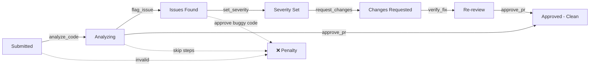

# 🔍 CodeReview RL Environment

**OpenEnv-Compatible Reinforcement Learning Benchmark for Agentic Code Review**

> A multi-step, deterministic RL environment that evaluates whether LLM agents can review code, identify bugs and security issues, assess severity, and manage pull requests effectively.

---

# 🌍 Overview

**CodeReview** is a **stateful reinforcement learning environment** designed to benchmark **agentic reasoning** in software development workflows.

Unlike static code analysis tools, CodeReview evaluates:

* Multi-step decision making in code review
* Bug and security vulnerability detection
* Severity assessment and prioritization
* PR dependency management
* Deterministic reward shaping
* Long-horizon planning under time constraints

The environment simulates a **code review system** where an AI agent must:

* Analyze pull requests for bugs, security issues, and style violations
* Flag issues with correct severity levels
* Request changes or approve PRs appropriately
* Verify fixes after changes
* Manage review queues with dependencies

The agent is scored using **dense deterministic rewards**.

---

# 🎯 Why This Exists

Traditional code analysis tools provide static feedback.

CodeReview tests **dynamic decision-making** in review workflows.

This evaluates whether an LLM can:

* Identify critical vs. minor issues
* Balance thoroughness with velocity
* Manage multiple PRs with dependencies
* Provide actionable feedback
* Verify fixes effectively
* Prioritize security over style

---

# 📊 How CodeReview Differs from Existing Benchmarks

| Benchmark Type | Steps | Bug Detection | Severity Assessment | Dependencies | State Transitions |
|----------------|-------|---------------|---------------------|--------------|-------------------|
| HumanEval      | 1     | ❌            | ❌                  | ❌           | ❌                |
| MBPP           | 1     | ❌            | ❌                  | ❌           | ❌                |
| CodeXGLUE      | 1-2   | Limited       | ❌                  | ❌           | ❌                |
| **CodeReview** | **15-25** | **✅**    | **✅**              | **✅**       | **✅**            |

## Key Limitations of Existing Benchmarks

**Single-Step Evaluation:** Most code benchmarks test if code runs correctly. They don't test whether an agent can review code through multiple steps.

**No Security Focus:** Existing benchmarks rarely test security vulnerability detection.

**No Severity Assessment:** Real code review requires distinguishing critical bugs from minor style issues.

**No Dependency Management:** Real workflows involve PRs that depend on other PRs.

## CodeReview Advantages

**Multi-Step Review Process:** Episodes span 15-25 steps, requiring agents to analyze, flag, assess, and approve/reject.

**Security-First:** Explicitly tests detection of security vulnerabilities (weak crypto, plaintext passwords, injection attacks).

**Severity Calibration:** Agents must correctly assess whether issues are critical, high, medium, or low severity.

**Dependency Chains:** Hard task includes PRs with dependencies, testing whether agents can block dependent PRs when base PR has issues.

---

# 🧩 Environment Design

## Observation Space

Each step returns:

```json
{
  "pull_requests": [...],
  "step": 0,
  "pending_reviews": 3,
  "review_pressure": 0.0,
  "code_standards": [...]
}
```

---

## Action Space

Discrete agent actions:

```
analyze_code       → Start analyzing a PR's code
flag_issue         → Identify issue type (bug, security, style, performance)
set_severity       → Set severity (critical, high, medium, low)
request_changes    → Ask developer to fix issues
approve_pr         → Approve clean code
verify_fix         → Verify that requested changes were fixed
```

Each action mutates environment state.

---

## State Transition Flow

PRs progress through a strict state machine. Invalid transitions are penalized.



**Valid Progressions:**
- Submitted → Analyzing → Issues Found → Severity Set → Changes Requested → Re-review → Approved
- Submitted → Analyzing → Approved (if no issues found)

**Invalid Transitions (Examples):**
- Approving without analyzing → invalid action penalty (-0.10)
- Flagging issues without analyzing → invalid action penalty (-0.10)
- Approving code with bugs → critical penalty (-0.80)
- Wrong severity assessment → penalty (-0.15)

---

## Reward Shaping

Dense deterministic rewards:

| Event                  | Reward |
| ---------------------- | ------ |
| Analyze code           | +0.05  |
| Correct bug detection  | +0.40  |
| Correct severity       | +0.15  |
| Actionable feedback    | +0.20  |
| Approve clean code     | +0.25  |
| Verify fix             | +0.10  |
| False positive         | -0.20  |
| Wrong severity         | -0.15  |
| Approve buggy code     | -0.80  |
| Miss critical bug      | -0.60  |
| Invalid transition     | -0.10  |
| Deadline breach        | -0.50  |

---

# 🧪 Tasks

## Easy — Single PR Review

Agent must:

1. Analyze simple PR
2. Identify obvious null pointer bug
3. Flag with correct severity (high)
4. Request changes

**Scenario:** Developer removed null check, causing potential crash.

**Max Steps:** 15  
**Perfect Score:** 1.00

---

## Medium — Multi-PR Queue

Agent must:

* Review 3 PRs with varying quality
* PR 1: Clean code (should approve)
* PR 2: Minor style issue (low severity)
* PR 3: Security vulnerability (critical severity)
* Prioritize security issue
* Approve clean code
* Request changes for bugs

**Scenario:** Mixed queue with clean code, style issue, and security vulnerability.

**Max Steps:** 20  
**Review Deadline:** 18 steps  
**Perfect Score:** 2.40

---

## Hard — Dependency Chain

Simulates complex scenario:

* 4 PRs with dependencies
* PR 1: Base library update with security vulnerability (MD5 crypto)
* PR 2: Feature depending on PR 1
* PR 3: Another feature depending on PR 1
* PR 4: Independent clean refactoring
* Must block dependent PRs until base PR is fixed
* Time pressure for critical fix

**Scenario:** Security vulnerability in base PR blocks dependent PRs.

**Max Steps:** 25  
**Review Deadline:** 22 steps  
**Perfect Score:** 3.50

---

# 📈 Baseline Performance Metrics

We evaluated a simple greedy agent (GPT-4-based) across all three difficulty levels:

| Difficulty | Max Score | Baseline Score | Success Rate | Avg Steps | Key Challenge |
|------------|-----------|----------------|--------------|-----------|---------------|
| Easy       | 1.00      | **0.95**       | 95%          | 4.5       | Single PR, clear bug |
| Medium     | 2.40      | **1.20**       | 50%          | 13.2      | Priority ordering |
| Hard       | 3.50      | **0.70**       | 20%          | 18.5      | Dependency management |

## Interpretation

**Easy (0.95):** The baseline agent achieves near-perfect score. This validates that the environment is solvable and rewards are correctly calibrated.

**Medium (1.20):** The agent struggles with prioritization. It often reviews PRs in order (1, 2, 3) instead of prioritizing the critical security issue in PR 3.

**Hard (0.70):** The agent fails to recognize PR dependencies. It often approves PR 2 and PR 3 before PR 1 is fixed, missing that they depend on the vulnerable crypto library.

## Difficulty Scaling

The decreasing scores (0.95 → 1.20 → 0.70) demonstrate that:
- Tasks increase in complexity
- Multi-PR reasoning is harder than single-PR
- Dependency detection requires understanding code imports
- Security vulnerability detection requires domain knowledge

---

# 🧩 Why This Environment Is Hard for LLMs

LLMs excel at code generation but struggle with multi-step code review under constraints.

## Challenge Factor 1: Security Vulnerability Detection

**Problem:** Identifying security issues requires domain knowledge (e.g., MD5 is cryptographically broken, passwords shouldn't be in tokens).

**Why LLMs Struggle:** LLMs may recognize common patterns but miss subtle vulnerabilities or context-specific issues.

**Example from Hard Task:** PR 1 changes `hashlib.sha256` to `hashlib.md5`. The agent must know that MD5 is broken for cryptographic use and flag it as critical severity.

## Challenge Factor 2: Severity Calibration

**Problem:** Distinguishing critical bugs from minor style issues requires judgment.

**Why LLMs Struggle:** LLMs tend to over-flag or under-flag issues without clear severity guidelines.

**Example from Medium Task:** PR 2 has a style issue (missing space: `users=db.query`). This is low severity. PR 3 has plaintext password in token (critical severity). The agent must correctly differentiate.

## Challenge Factor 3: Dependency Management

**Problem:** Recognizing that PR 2 and PR 3 import from PR 1's modified crypto library requires code analysis.

**Why LLMs Struggle:** LLMs must parse import statements, track dependencies, and reason about cascading effects.

**Example from Hard Task:** PR 2 has `from lib.crypto import encrypt_data`. The agent must recognize this depends on PR 1, and if PR 1 has a security issue, PR 2 should wait.

## Challenge Factor 4: False Positive Avoidance

**Problem:** Flagging non-issues wastes developer time and reduces trust.

**Why LLMs Struggle:** LLMs may be overly cautious and flag clean code as problematic.

**Example from Medium Task:** PR 1 is clean validation code. If the agent flags it as a bug, it incurs a false positive penalty (-0.20).

---

# 🔁 RL Loop

Agent interacts via:

```python
reset()
step(action)
state()
```

Episode continues until:

* All PRs reviewed (approved or changes requested)
* Review deadline exceeded
* Max steps reached

---

# 🔒 Deterministic Guarantee

**CodeReview is fully deterministic.**

## What This Means

Given the same:
- Initial state (task scenario)
- Action sequence

The environment will **always** produce:
- Identical state transitions
- Identical rewards
- Identical final score

## Why This Matters for RL

**Reproducibility:** Experiments can be exactly replicated across runs, machines, and researchers.

**Debugging:** If an agent fails, you can replay the exact action sequence to diagnose the issue.

**Fair Evaluation:** All agents are evaluated on identical scenarios with identical reward functions.

**No Randomness:** No random number generation, no sampling, no non-deterministic state updates.

---

# 🌐 OpenEnv HTTP API

Endpoints:

```
POST /reset?task=easy|medium|hard
POST /step
GET  /state
GET  /schema
GET  /metadata
GET  /health
POST /mcp
```

---

# 🧠 Example Agent Rollout

```
[START] task=easy env=codereview_env model=Qwen/Qwen2.5-72B-Instruct

[STEP] step=1 action=analyze_code(1) reward=0.05 done=false error=null
[STEP] step=2 action=flag_issue(1,"bug") reward=0.40 done=false error=null
[STEP] step=3 action=set_severity(1,"high") reward=0.15 done=false error=null
[STEP] step=4 action=request_changes(1) reward=0.20 done=true error=null

[END] success=true steps=4 score=0.800 rewards=0.05,0.40,0.15,0.20
```

---

# ⚠️ Agent Failure Cases

## Failure Mode 1: Approving Buggy Code

**Scenario:** Agent approves PR without analyzing or misses critical bug.

**Action Sequence:**
```
[STEP 1] approve_pr(id=1)  → reward=-0.80 ✗ (approved buggy code)
[END] total_reward=-0.80
```

**Cascading Consequences:**
1. Critical bug ships to production
2. Massive penalty (-0.80)
3. Episode ends immediately

**Root Cause:** Skipping analysis step or failing to detect bug.

---

## Failure Mode 2: Wrong Severity Assessment

**Scenario:** Agent flags security issue as low severity instead of critical.

**Action Sequence:**
```
[STEP 1] analyze_code(id=3)           → reward=+0.05 ✓
[STEP 2] flag_issue(id=3, "security") → reward=+0.40 ✓
[STEP 3] set_severity(id=3, "low")    → reward=-0.15 ✗ (wrong severity)
[END] total_reward=+0.30
```

**Root Cause:** Misunderstanding severity guidelines or missing context.

---

## Failure Mode 3: Ignoring Dependencies

**Scenario:** Agent approves dependent PR before base PR is fixed.

**Action Sequence:**
```
[STEP 1] analyze_code(id=1)              → reward=+0.05 ✓
[STEP 2] flag_issue(id=1, "security")    → reward=+0.40 ✓
[STEP 3] analyze_code(id=2)              → reward=+0.05 ✓
[STEP 4] approve_pr(id=2)                → reward=-0.80 ✗ (depends on buggy PR 1)
[END] total_reward=-0.30
```

**Root Cause:** Not recognizing import dependencies in code.

---

# 🚀 Live Deployment

**Hugging Face Space:** [Your Space URL Here]

**Live API Base URL:** [Your API URL Here]

---

# 📦 Project Structure

```
codereview-env/
│
├── env/
│   ├── __init__.py
│   └── env.py
│
├── tasks/
│   ├── __init__.py
│   ├── easy.py
│   ├── medium.py
│   └── hard.py
│
├── server/
│   ├── __init__.py
│   └── app.py
│
├── tests/
│   ├── conftest.py
│   ├── unit/
│   ├── integration/
│   ├── validation/
│   └── infrastructure/
│
├── server.py
├── inference.py
├── openenv.yaml
├── Dockerfile
├── requirements.txt
├── pyproject.toml
│
├── .env.example
├── .gitignore
├── README.md
├── DEPLOYMENT.md
├── HF_SPACE_SETUP.md
└── LICENSE
```

---

# ⚙️ Run Locally

Install dependencies:

```bash
pip install -r requirements.txt
```

Run server:

```bash
uvicorn server:app --host 0.0.0.0 --port 7860
```

Test in another terminal:

```bash
curl -X POST "http://localhost:7860/reset?task=easy"
```

---

# 🧪 Validate with OpenEnv

```bash
openenv validate --url http://localhost:7860
```

Expected output:

```
✓ Environment responds
✓ Reset endpoint works
✓ Step endpoint works
✓ Schema is valid
✓ All tasks available
passed: true
```

---

# 🤖 Run Agent

Set environment variables:

```bash
export API_BASE_URL=https://router.huggingface.co/v1
export MODEL_NAME=Qwen/Qwen2.5-72B-Instruct
export HF_TOKEN=your_token_here
```

Run inference:

```bash
python inference.py
```

Expected output:

```
[START] task=easy env=codereview_env model=Qwen/Qwen2.5-72B-Instruct
[STEP] step=1 action=analyze_code(1) reward=0.05 done=false error=null
...
[END] success=true steps=4 score=0.800 rewards=0.05,0.40,0.15,0.20
```

---

# 🐳 Docker

Build:

```bash
docker build -t codereview-env .
```

Run:

```bash
docker run -p 7860:7860 codereview-env
```

Test:

```bash
curl http://localhost:7860/health
```

---

# 🧠 Benchmark Goals

CodeReview evaluates:

* Multi-step code review reasoning
* Security vulnerability detection
* Severity assessment accuracy
* Dependency management
* False positive avoidance
* Deterministic reward optimization

---

# 🔬 Research Use Cases

## Use Case 1: Evaluating Code Review Agents

**Application:** Benchmark LLM agents on code review tasks.

**Research Questions:**
- Can agents detect security vulnerabilities?
- Do agents correctly assess severity?
- How do agents handle PR dependencies?

**Why CodeReview:** Multi-step review process with security focus.

---

## Use Case 2: RL Training for Code Review

**Application:** Train RL policies for automated code review.

**Research Questions:**
- Can RL agents learn to detect bugs from rewards?
- How many episodes needed to learn severity calibration?

**Why CodeReview:** Deterministic rewards enable reproducible RL training.

---

## Use Case 3: Security Vulnerability Detection

**Application:** Study automated security vulnerability detection.

**Research Questions:**
- What features predict security issues?
- Can agents learn security patterns?

**Why CodeReview:** Explicit security vulnerability scenarios.

---

# 📊 Evaluation Method

The evaluator:

1. Calls `/reset` for each task
2. Runs LLM agent loop
3. Logs `[STEP]` trajectory
4. Computes normalized score
5. Verifies deterministic rewards

---

# ✅ OpenEnv Compliance

This environment implements:

* reset / step / state API
* Deterministic reward shaping
* Pydantic schemas
* OpenAPI schema
* MCP endpoint
* Docker deployment
* Hugging Face Space hosting

---

# 🏁 Hackathon Submission

* OpenEnv compliant ✓
* RL multi-step environment ✓
* Deterministic grading ✓
* 3 tasks (easy, medium, hard) ✓
* Baseline inference provided ✓
* Docker deployment ✓
* HF Space ready ✓

---

# 📜 License

MIT License

---

# 👨💻 Author

Built for **Meta × PyTorch × Scaler OpenEnv Hackathon**

Designed to benchmark **agentic reasoning in code review workflows**
